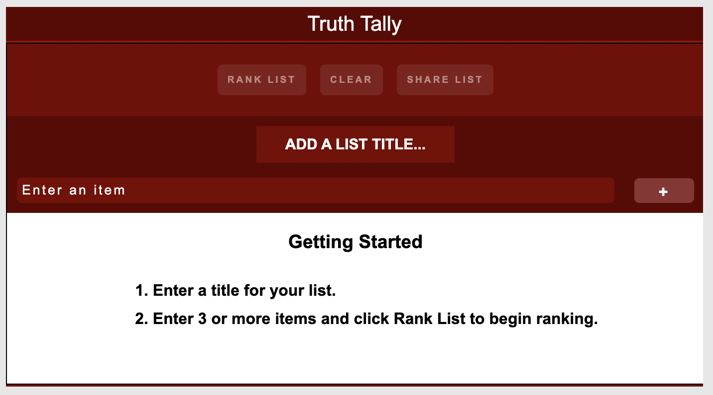
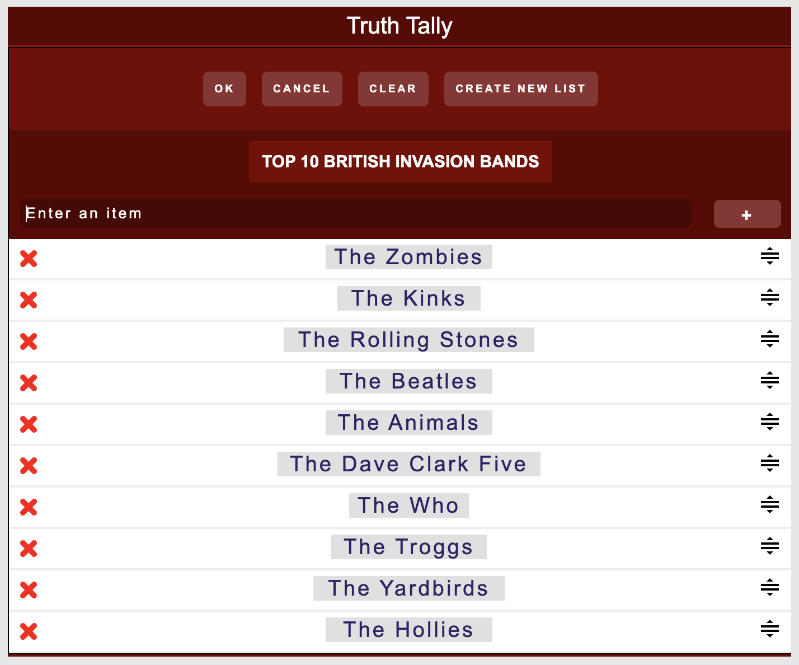
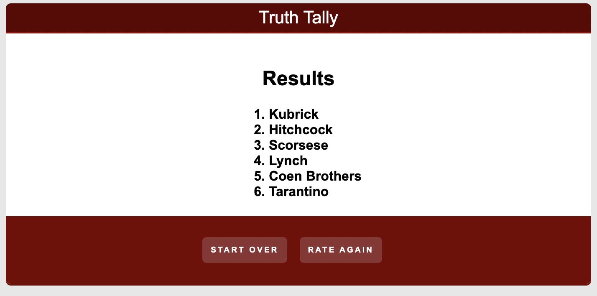

# Truth Tally

Link to web app: [https://truthtally.danielr.io/](https://truthtally.danielr.io/)

## Description

This React based app will allow you to create a list, and sort based on your choice from randomized unique pairings.

## Usage

1. Enter a list of items to compare (i.e., Beatles, Led Zeppelin, Pink Floyd, Black Sabbath)
2. Click/tap on Begin
3. Select a favored item from one of the pairs of items displayed.
4. Results are then displayed.

`- The Begin button only appears once there are 3 items in the list`

`- Each selection increases the score of the selected item`
`- Rate Again will clear scores and begin the ratng process again`

`- Start Over will clear the list, requiring entering items again`

## Screenshots

### `Development`

To develop further on this app, you will want to fork the repo, then clone your fork into your local git repository.

In terminal, CD into your cloned repo and enter `npm install`, then run the app by entering `npm start`

