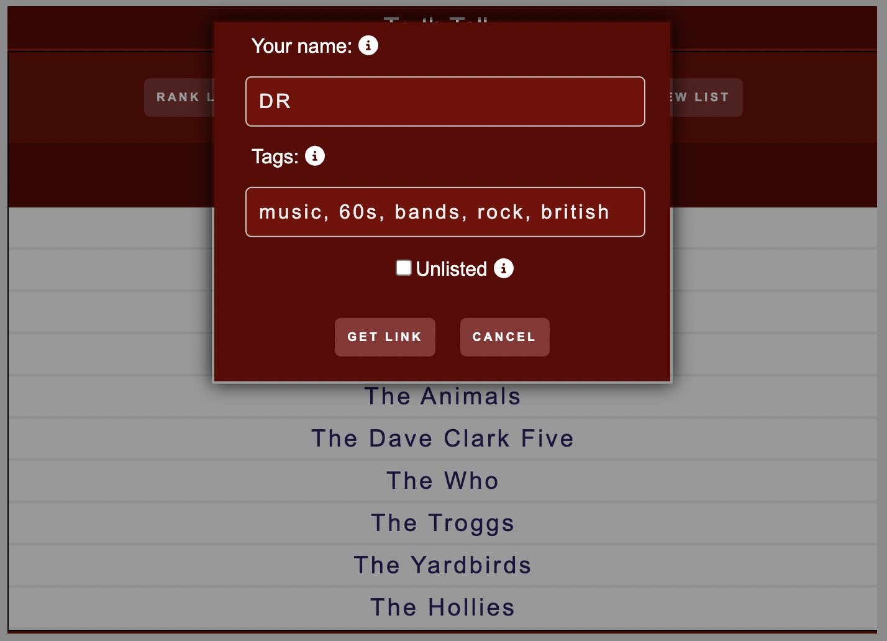

# Truth Tally

### Link to web app: [https://truthtallyranker.com](https://truthtallyranker.com)

<br />
<br />

---

## Description

This Next.js, React, and Node.js based app will allow you to create a list, and sort based on your choice from randomized unique pairings.

<br />

## Usage

1. Enter a list of items to rank (i.e., Beatles, Led Zeppelin, Pink Floyd, Black Sabbath)
2. Click/tap on Rank List
3. During each round, click/tap on the favored item from between the two items
4. Results are then displayed.

<br />

- `The Rank List button only appears once there are 3 items in the list`

- `Each selection increases the score of the selected item`

- `Rank Again will clear scores and begin the ratng process again`

<br />

## List Sharing

You can share your ranked and unranked lists. Sharing a list will save your list to the database, and the list will be stored on Truth Tally's server.

When sharing, you have the option to enter:

- `Name: Enter your name or a nickname to display as the person who created or ranked the list when sharing unranked or ranked lists with others.`

- `Tags: Add up to 6 tags, using single words without spaces and up to 20 characters each, to improve searchability and aid others in discovering your list.`

- `Unlisted: Your list won't appear on the public shared lists page*, but can still be shared with others using a unique link.`

\*Feature currently in development

<br />

---

## Screenshots

<div style="text-align: center;">


New List

<br />


Enter a title and items to rank

<br />


Share List modal

<br />


Ranking items

<br />


Ranked list

<br />

</div>

---

<br />

## `Development`

To develop further on this app, you will want to fork the repo, then clone your fork into your local git repository.

1. In terminal, CD into your cloned forked repo and enter `npm install`
2. This app uses a MongoDB Atlas database. You can sign up for a free MongoDB Atlas account, and follow the getting started tutorial [here](https://www.mongodb.com/basics/mongodb-atlas-tutorial).
3. You will need to create an `.env.local` file in your project's root folder and add the following environmental variables:

```
MONGODB_URI="mongo_db_connection_string"
MONGODB_DATABASE="database_name"
MONGODB_COLLECTION="collection_name"
API_URL=http://127.0.0.1:3000
```

4. Run the app in development mode by running the command `npm run dev`

You can see how to get your MonoDB Connection String [here](https://www.mongodb.com/docs/manual/reference/connection-string/)
